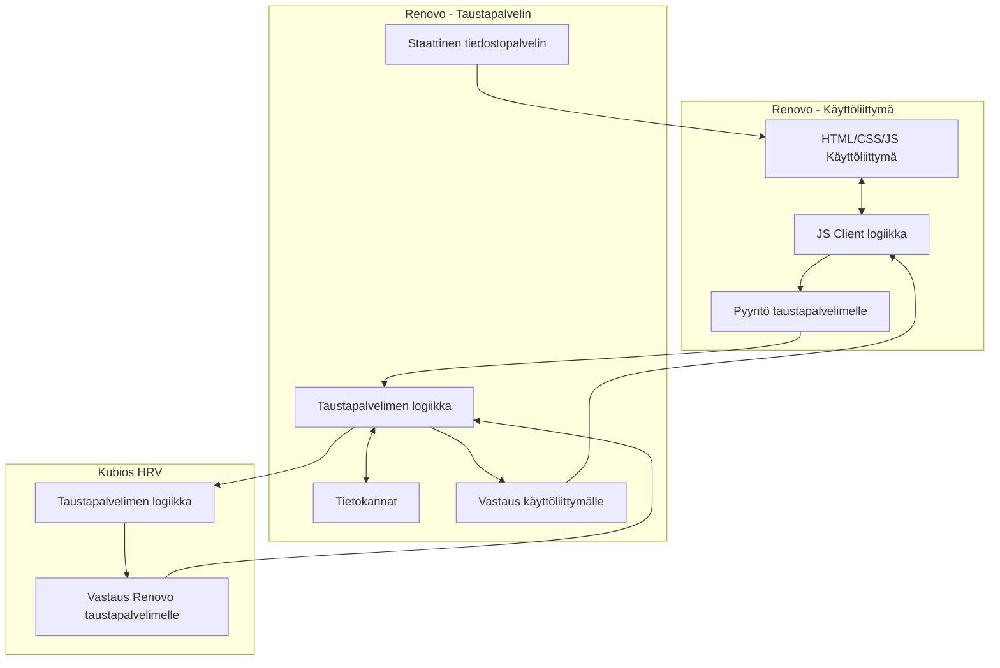
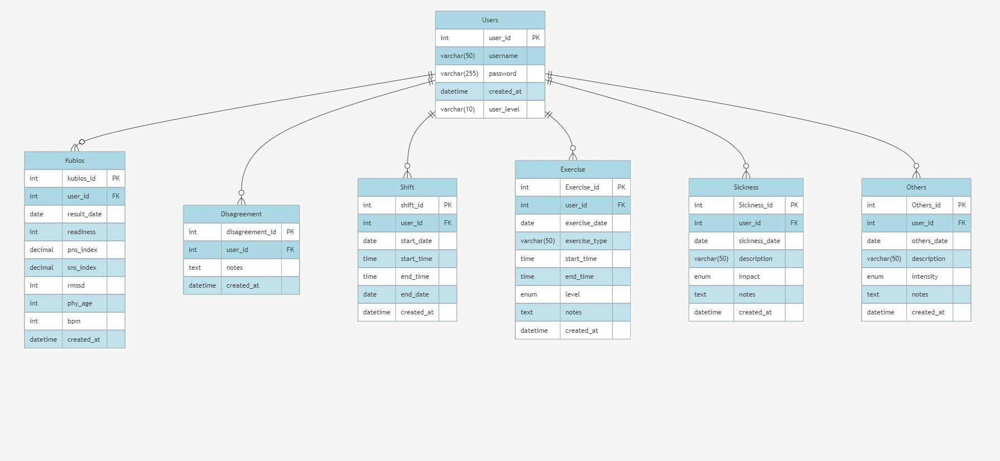

# Renovo

Renovo sovelluksen tarkoitus on seurata käyttäjän hyvinvointia ja jaksamista analysoimalla HRV-dataa (sydämen sykevälivaihtelu). Käyttäjä kykenee sisäänkirjautumisen jälkeen tarkastelemaan seuranta- ajalla kertyneitä HRV arvojaan, sekä antamaan niistä sovelluksen kautta palautetta. Käyttäjä voi myös syöttää omakohtaista tietoa, jotka vaikuttavat HRV- dataan, kuten työvuorot, urheilun, sairaustapaukset jne. HRV data saadaan Kubios HRV- sovelluksen kautta ([Kubios Oy](https://www.kubios.com/)). Renovo sovellus myös tarkistaa pitää silmällä seuranta- aikaa, tehden sen päätyttyä lopullisen pyynnön käyttäjän datasta, joka tallennetaan tietokantaan.

## Sisällysluettelo

- [Yleiskatsaus](#yleiskatsaus)
- [Projektin rakenne](#projektin-rakenne)
- [Käytetyt tekniikat](#käytetyt-tekniikat)
- [Taustapalvelimen asennus, riippuvuudet ja tietokannat](#taustapalvelimen-asennus-riippuvuudet-ja-tietokannat)
- [Tietokanta rakenne](#tietokanta-rakenne)
- [Dokumentaatio](#dokumentaatio)
- [Ei- implementoidut toiminnot](#ei--implementoidut-toiminnot)
- [Tukimateriaali ja kunniamaininnat](#tukimateriaali-ja-kunniamaininnat)
- [Bugit ja ongelmat](#bugit-ja-ongelmat)
- [Tekijät](#tekijät)

## Yleiskatsaus

Tämä repositorio sisältää taustapalvelimen **Renovo**-sovellukselle. Sovelluksen käyttöliittymä löytyy erillisestä repositoriosta: [Renovo_fe](https://github.com/Rocmu/Renovo_fe).

Taustapalvelin käsittelee käyttöliittymän (Client) kautta tulevat pyynnöt ja vastaa annettujen ohjeiden mukaisesti.

## Projektin rakenne

**Taustapalvelin**: Node.js + Express taustapalvelin MySQL/MariaDB tietokannalla. Projekti on rakennettu vastaamaan **Model-View-Controller (MVC)**- mallia. Alla on esitetty projektin MVC- tiedostomalli.

```dir
src/
├── controllers/
│   ├── disagreement-controller.js
│   └── exercise-controller.js
│   └── kubios-auth-controller.js
│   └── kubios-controller.js
│   └── others-controller.js
│   └── save-hrv-controller.js
│   └── shift-controller.js
│   └── sickness-controller.js
├── documentation/
├── middlewares/
├── models/
│   ├── disagreement-model.js
│   └── exercise-model.js
│   └── kubios-model.js
│   └── others-model.js
│   └── shift-model.js
│   └── sickness-model.js
│   └── user-model.js
├── routes/
│   ├── auth-router.js
│   └── disagreement-router.js
│   └── exercise-router.js
│   └── kubios-router.js
│   └── others-router.js
│   └── shift-router.js
│   └── sickness-router.js
│   └── user-router.js
├── utils/
└── index.js
```

### Renovo - REST arkkitehtuuri ja Kubios



## Käytetyt tekniikat

- Node.js
- Express.js
- MySQL / MariaDB
- JWT Authentication
- Docker
- Cross- Origin Resource Sharing (CORS)
- Apidoc

## Taustapalvelimen asennus, riippuvuudet ja tietokannat

Kloonaa repositorio:

```bash
git clone https://github.com/Rocmu/Renovo_be.git
cd Renovo_be
```

Node moduulien ja riippuvuuksien asennus: `npm i` tai vaihtoehtoisesti `npm install`.

Muut tarvittavat paketit ja niiden asennus:
- Express.js: aja komento: `npm install express`
- Cross- Origin Resource Sharing (CORS): `npm install cors`
- Apidoc: `npm install apidoc`
- MySQL2: `npm install --save mysql2`
- JSON Web Token (JWT): `npm install jsonwebtoken`
- bcrypt.js: `npm i bcryptjs`
- express-validator: `npm install express-validator`
- Dotenv: `npm i dotenv`
- Nodemon: `npm install --save-dev nodemon`
- Node Fetch: `npm install node-fetch`
- Axios: `npm i axios`
- UUID: `npm i uuid`

Asenna ja käynnistä MySQL/MariaDB-palvelin.

Tuo tietokanta osoitteesta:

```bash
source <reitti omalta koneelta>/database/renovo.sql
```

Anna itsellesi myös paikallisesti oikeudet tietokantaan. Ohjeet database/create-user-example.sql- tiedostossa.

Luo `.env`-tiedosto `.env.sample`-tiedoston perusteella ja määritä muuttujat. Ohjeet [muuttujien määrittämiseen](https://github.com/mattpe/hyte-web-dev/blob/main/12-kubios.md) --> "Implement Login Using Kubios Cloud" --> "2. Add Kubios settings to `.env` file (and to .env-sample)".

Client Id on kurssimateriaaleissa.

Node-projektin ajaminen bashissa: `npm run dev`

## Tietokanta rakenne

Tietokannan rakenne on esitetty alla olevassa kuvassa (Kuva 1).


Kuva 1. Renovo- sovelluksen tietokannan rakenne ja riippuvuudet.

Kuten kuvassa 1 näkyy, "Users"- taulukko on päätaulukko, jossa määritellään käyttäjät. Kaikki muut taulukot ovat siitä riippuvaisia. Taulukot on luotu vastaamaan ohjelmistolta vaadittuja toimintoja.

## Dokumentaatio

Kaikista API- pyynnöistä on tehty vaatimusten mukainen dokumentaatio. Ohessa on linkki dokumentaation ---> [Apidoc](https://thehyte.northeurope.cloudapp.azure.com/api/)

Dokumentaatio löytyy myös projektin tiedostoista src/documentation- kansiosta.

## Ei- implementoidut toiminnot

Suunnitelmissa oli kehittää sovelluksesta näkymät usealle eri käyttäjätyypille. Tämän toiveen puitteissa taustapalvelimelle kehitettiin myös pyyntöjä, joihin vain tietyillä käyttäjillä on oikeudet. Valitettavasti aikataulun puitteissa ehditiin toteuttaa vain peruskäyttäjän näkymä käyttöliittymässä.

Jatkokehitystä varten kaikki luodut pyynnöt jätettiin taustapalvelimeen valmiiksi. Muutamaa ei vain suoriteta käyttöliittymän puolelta. Sovelluskehityksessä myös tehtiin muutoksia esimerkiksi käyttäjän kykyyn muokata antamaansa palautetta. Kaikki valmiiksi tehdyt pyynnöt, joita ei käytetty Client- puolella on lueteltu ohessa.

### Ei- implementoidut pyynnöt:
- Kaikkien tietokannasta löytyvien työvuoromerkintöjen tulostus pyyntö (nimi: getShifts)
- Kaikkien tietokannasta löytyvien liikuntamerkintöjen tulostus pyyntö (nimi: getExercises)
- Kaikkien tietokannasta löytyvien sairausmerkintöjen tulostus pyyntö (nimi: getSicknesses)
- Kaikkien tietokannasta löytyvien "muu"- merkintöjen tulostus pyyntö (nimi: getOthers)
- Kaikkien tietokannasta löytyvien  palautteiden tulostus pyyntö (nimi: getDisagreements)
- Tietyn palautteen tulostus pyyntö (nimi: getDisagreementById)
- Tietyn palautteen muokkaus pyyntö (nimi: putDisagreement)
- Tietyn palautteen poisto pyyntö (nimi: deleteDisagreement)

Kaikki luetellut pyynnöt ovat täysin toimintakelpoisia, vaikka niitä ei käytetty sovelluksen tämänhetkisessä versiossa. Ei- implementoidut pyynnöt löytyvät myös [dokumentaatiosta](#dokumentaatio).

## Tukimateriaali ja maininnat

Sovelluksen rakentamisessa ollaan käytetty apuna opettajien tarjoamia [kurssimateriaaleja](https://github.com/mattpe/hyte-web-dev/blob/main/01-tools-env.md). Varsinkin Kubios pyynnöt on rakennettu [esimerkkikoodin](https://github.com/mattpe/hyte-web-dev/blob/main/12-kubios.md) perusteella. Materiaaleja ollaan sovellettu myös arkkitehtuurin kuvaajien piirtämisessä ja tiedon haussa.

#### Suuret kiitokset [mattpe](https://github.com/mattpe), jonka koodin avulla rakennettiin API- pyyntöjä Kubios HRV:n!

Kurssin ulkopuolinen materiaali:
- Tutoriaali(t): [Youtube- Learn JavaScript DATE objects in 8 minutes!](https://www.youtube.com/watch?v=LwYwz67l1lA)
- Muu hyödynnetty lukumateriaali: [W3Schools](https://www.w3schools.com/)

## Bugit ja ongelmat

Taustapalvelimessa ei ole havaittu toiminnallisia ongelmia.

## Tekijät

- Rocmu --> [Github](https://github.com/Rocmu)

- Nappulat --> [Github](https://github.com/Nappulat)
